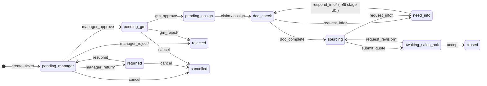

# Phase 1 — Database Design

> MGS Enterprise Price Request & Sourcing System
> ไฟล์ที่เกี่ยวข้อง:
> - `supabase/migrations/20261005000000_init_price_request.sql` — schema ทั้งหมด (รันครั้งเดียว)
> - `supabase/seed.sql` — ข้อมูลตัวอย่าง (users ทุก role, แผนก, product groups, vendors, ใบตัวอย่าง 4 ใบ)
> - `supabase/tests/acceptance_test.sql` — ทดสอบ acceptance criteria (rollback อัตโนมัติ)

---

## 1. สรุปความเข้าใจ

ระบบใบขอราคาภายใน MGS ที่ไหล **Sales → Manager → GM → SR → Sales** โดยทุกการเปลี่ยนสถานะต้องผ่าน
`transition_ticket()` ใน database เท่านั้น ทุก action ถูกบันทึกลง `ticket_logs` แบบ append-only
SR เปรียบเทียบราคา vendor ได้สูงสุด 3 เจ้า/รายการ โดยระบบ normalize VAT + FX เป็น "ต้นทุนสุทธิ THB" ให้เทียบกันได้
Dashboard คำนวณทั้งหมดฝั่ง database (RPC) และเคารพ RLS ของผู้เรียก

## 2. Assumptions และการตัดสินใจ (จุดที่ requirement คลุมเครือ/ขัดกัน)

| # | ประเด็น | ทางที่เลือก (แนะนำ) | ทางเลือกอื่น |
|---|---|---|---|
| A1 | Manager "Return" ให้ Sales แก้ แต่ไม่มี stage รองรับ | เพิ่ม stage `returned` (ใต้ `Requested`) → Sales แก้แล้วกด `resubmit` กลับไป `pending_manager` | ใช้ `pending_manager` + flag — แต่ดูไม่ออกว่าใครถืองาน |
| A2 | Sales ยกเลิกใบ — มีแค่ 5 main status | ใช้ status `Rejected` + stage `cancelled` (แยกสถิติจาก reject ได้ด้วย stage) | เพิ่ม status `Cancelled` (ขัดข้อกำหนด 5 status) |
| A3 | Terminal stage | `closed`, `rejected`, `cancelled` เป็น stage ด้วย เพื่อให้ `status = stage_status(stage)` เป็น CHECK constraint เสมอ | ให้ stage เป็น NULL ตอนจบ |
| A4 | ค่า enum มีช่องว่าง (`On Process`, `Ex VAT`) | เก็บเป็น snake_case (`on_process`, `ex_vat`) แล้วแปลง label ที่ UI / `stage_label_th()` | ใช้ค่ามีช่องว่าง — ใช้ยากใน TS/URL |
| A5 | "SR Lead" ไม่มีใน role list | เพิ่ม flag `profiles.is_sr_lead` (role ยังเป็น `sr`) — Lead/Admin ใช้ action `assign` ได้ | เพิ่ม role ใหม่ (ขัดกับ "1 user 1 role") |
| A6 | GM มีหลายคนได้ไหม | ได้ — ใครก็ได้ที่ role = `gm` อนุมัติได้ (แจ้งเตือนทุกคน) และ `gm_id` บันทึกคนที่กดจริง | fix GM ต่อแผนก |
| A7 | Manager เห็นใบไหน | ใบของ department ที่ตัวเองเป็น `departments.manager_id` + ใบที่ตัวเองเคยอนุมัติ (`tickets.manager_id`) | เฉพาะ department ปัจจุบัน |
| A8 | Sales แก้ไขได้ "ตอนยังไม่ถูกอนุมัติ" | แก้ header/items ได้เฉพาะ stage `pending_manager`, `returned`; ช่วง `need_info` แนบไฟล์ + ตอบ comment ได้ แต่ **แก้ qty/รายการไม่ได้** (ป้องกันเปลี่ยนของหลังอนุมัติ) | เปิดให้แก้ items ตอน need_info (ต้องอนุมัติใหม่) |
| A9 | Sales/Manager เห็นราคา vendor เมื่อไหร่ | เห็นเมื่อ status = `Completed`/`Closed` เท่านั้น (draft ของ SR ซ่อน) — GM/SR/Admin เห็นตลอด | เห็นตลอด |
| A10 | VAT rate ใน generated column (ห้ามอ้าง settings table) | เก็บ `vat_rate` เป็น **snapshot** ในแต่ละแถว quotation (trigger ดึงจาก `app_settings` ตอน INSERT) → ราคาย้อนหลังไม่เปลี่ยนเมื่อแก้อัตรา VAT | คำนวณใน view ด้วย rate ปัจจุบัน (ย้อนหลังเพี้ยน) |
| A11 | เลือกผู้ชนะที่ไม่ใช่ถูกสุด ต้องมีเหตุผล | บังคับตอน `submit_quote` (ตอนบันทึกร่างไม่บังคับ) เทียบด้วย `net_unit_cost_thb` | บังคับทุกครั้งที่บันทึก |
| A12 | SR ขอข้อมูลเพิ่มระหว่าง `sourcing` | อนุญาต — ระบบจำ `return_stage` แล้ว Sales ตอบกลับจะกลับไป stage เดิมของ SR คนเดิม | ให้ขอได้เฉพาะ doc_check |
| A13 | SLA | นับเป็น **ชั่วโมงปฏิทิน** ต่อ stage (ตั้งค่าใน `app_settings.sla_hours`), เตือนที่ 80% (`sla_warning_ratio`) | ชั่วโมงทำงาน/วันหยุด — เพิ่มตาราง holiday ภายหลังได้ |
| A14 | Optimistic locking | `p_payload.expected_version` **บังคับส่ง** ทุก transition | optional |
| A15 | Storage path ของใบเสนอราคา vendor | `tickets/{ticket_id}/quotations/{item_id}/{file}` แยกโฟลเดอร์ เพื่อซ่อนไฟล์ราคาจาก Sales จนกว่าจะ Completed | ใช้ `tickets/{ticket_id}/{item_id}/` ร่วมกัน (Sales จะเห็นไฟล์ราคาก่อนเวลา) |
| A16 | ผู้ใช้สมัครใหม่ | สร้าง profile อัตโนมัติเป็น `sales` + `is_active = false` จน Admin เปิดใช้และกำหนด role/แผนก (role จาก metadata ไม่ถูกเชื่อ) | ให้ Admin สร้าง user เองเท่านั้น |
| A17 | ห้ามอนุมัติใบตัวเอง | ตรวจ `requestor_id <> actor` ทุก approval + GM ต้องไม่ใช่คนเดียวกับ Manager ที่อนุมัติ | — |
| A18 | ลบ ticket | ไม่มีใครลบได้ (ไม่มี DELETE grant + FK `ticket_logs → tickets ON DELETE RESTRICT`) ใช้ `cancel` แทน | soft delete |

## 3. ตารางเพิ่มเติมจาก guideline (พร้อมเหตุผล)

| ตาราง/คอลัมน์ | เหตุผล |
|---|---|
| `ticket_counters` | gen เลข `PR-YYYY-NNNN` ด้วย `INSERT … ON CONFLICT DO UPDATE` → row lock ต่อปี ไม่ซ้ำแม้สร้างพร้อมกัน, รีเซ็ตทุกปีอัตโนมัติ (ปีตามเวลา Asia/Bangkok) |
| `vendors` | master สำหรับ autocomplete และดูประวัติ; trigger จับคู่ `vendor_name` → `vendor_id` ให้อัตโนมัติ |
| `sla_alerts` | กันแจ้งเตือน SLA ซ้ำ (1 warning + 1 breach ต่อการเข้า stage แต่ละครั้ง) |
| `tickets.stage_entered_at` | ใช้คิด aging/SLA ของ stage ปัจจุบัน |
| `tickets.department_id` | snapshot แผนกตอนสร้าง — RLS ของ Manager และ report ไม่เพี้ยนเมื่อ Sales ย้ายแผนก |
| `tickets.info_request` | เก็บรายการเอกสารที่ SR ขอเพิ่ม (แสดงให้ Sales ทันทีโดยไม่ต้องค้น log) |
| `vendor_quotations.ticket_id` | denormalize (trigger บังคับให้ตรงกับ item) → RLS เร็วและเขียนง่าย |
| `vendor_quotations.vat_rate` | snapshot อัตรา VAT (ดู A10) |
| `ticket_logs.log_type`, `stage_duration_seconds` | แยก transition / data_change; เก็บเวลาที่อยู่ใน stage ก่อนหน้า → cycle time/คอขวดคำนวณได้ทันที |
| `notifications.delivery` | Edge Function บันทึกผลส่ง Lark/Email (เปลี่ยน channel ได้โดยไม่แก้ schema) |

## 4. State Machine

Main status: `pending_manager, returned, pending_gm` = **Requested** · `pending_assign, doc_check, need_info, sourcing` = **On Process** ·
`awaiting_sales_ack` = **Completed** · `closed` = **Closed** · `rejected, cancelled` = **Rejected**
`*` = บังคับ comment

| Action | ผู้ทำ | จาก stage | ไป stage | เงื่อนไขพิเศษ |
|---|---|---|---|---|
| `create_ticket()` | Sales | — | pending_manager | ต้องมีแผนก + แผนกมี Manager, items ≥ 1 |
| `resubmit` | Sales เจ้าของ | returned | pending_manager | |
| `cancel` | Sales เจ้าของ | pending_manager / returned / pending_gm | cancelled | ก่อน GM อนุมัติเท่านั้น |
| `manager_approve` | Manager ของแผนก | pending_manager | pending_gm | ไม่ใช่ใบตัวเอง |
| `manager_reject` | Manager ของแผนก | pending_manager | rejected | เหตุผลบังคับ |
| `manager_return` | Manager ของแผนก | pending_manager | returned | comment บังคับ |
| `gm_approve` | GM | pending_gm | pending_assign | ไม่ใช่ใบตัวเอง / ไม่ใช่คนที่อนุมัติขั้น 1 |
| `gm_reject` | GM | pending_gm | rejected | เหตุผลบังคับ |
| `claim` | SR | pending_assign | doc_check | สร้าง checklist จาก template ของทุก product group (รวม parent) |
| `assign` | SR Lead / Admin | pending_assign / doc_check / need_info / sourcing | doc_check หรือ stage เดิม | `payload.sr_id` ต้องเป็น SR active |
| `request_info` | SR ผู้รับงาน | doc_check / sourcing | need_info | comment บังคับ, `payload.missing_items` |
| `respond_info` | Sales เจ้าของ | need_info | stage เดิมของ SR | comment บังคับ |
| `doc_complete` | SR ผู้รับงาน | doc_check | sourcing | checklist ที่ `is_required` ต้องติ๊กครบ |
| `submit_quote` | SR ผู้รับงาน | sourcing | awaiting_sales_ack | ทุก item มี vendor ≥ 1, มีผู้ชนะ 1, ถ้าไม่ใช่ถูกสุดต้องมีเหตุผล, ราคาผู้ชนะยังไม่หมดอายุ |
| `accept` | Sales เจ้าของ | awaiting_sales_ack | closed | |
| `request_revision` | Sales เจ้าของ | awaiting_sales_ack | sourcing | comment บังคับ, `revision_count + 1` |

## 5. VAT & Price Normalization

| vat_term | ต้นทุนสุทธิ (`net_unit_cost_thb`) | ราคาจ่ายจริงรวม VAT (`gross_unit_price_thb`) |
|---|---|---|
| `ex_vat` | price × fx | price × (1 + vat_rate) × fx |
| `include_vat` | price ÷ (1 + vat_rate) × fx | price × fx |
| `no_vat` | price × fx (ขอคืน VAT ไม่ได้) | price × fx |

- คอลัมน์ทั้งสามเป็น `GENERATED ALWAYS … STORED` ในตาราง `vendor_quotations`
- `total_cost_thb`, `total_gross_thb`, `cost_rank`, `is_cheapest` อยู่ใน view `v_quotation_compare` (ต้องใช้ qty ของ item)
- `currency = 'THB'` บังคับ `fx_rate = 1` (CHECK constraint)

## 6. Permission Matrix

สัญลักษณ์: ✅ ได้ทั้งหมด · 🔸 ได้ตามเงื่อนไข · ❌ ไม่ได้ · RPC = ทำผ่านฟังก์ชันเท่านั้น

### 6.1 ตาราง (SELECT / INSERT / UPDATE / DELETE)

| ตาราง | Sales | Manager | GM | SR | Admin |
|---|---|---|---|---|---|
| `profiles` | S ✅ · U 🔸 ตัวเอง (ชื่อ/เบอร์/Lark id) | เหมือน Sales | เหมือน Sales | เหมือน Sales | S ✅ · U ✅ (role, แผนก, active) |
| `departments`, `product_groups` | S ✅ | S ✅ | S ✅ | S ✅ | S/I/U/D ✅ |
| `app_settings` | S ✅ | S ✅ | S ✅ | S ✅ | S/I/U ✅ |
| `vendors` | S ✅ | S ✅ | S ✅ | S/I/U ✅ | S/I/U ✅ |
| `tickets` | S 🔸 ใบตัวเอง · I = RPC `create_ticket` · U 🔸 header (title, description, customer, priority, due_date) เมื่อ `pending_manager`/`returned` | S 🔸 ใบของแผนกตัวเอง | S ✅ | S 🔸 ใบที่ GM อนุมัติแล้ว | S ✅ |
| `tickets.status / stage / assignee` | RPC `transition_ticket` | RPC | RPC | RPC | RPC |
| `ticket_items` | S 🔸 · I/U/D 🔸 เมื่อ `pending_manager`/`returned` | S 🔸 | S ✅ | S 🔸 | S ✅ |
| `vendor_quotations` | S 🔸 เมื่อ Completed/Closed | S 🔸 เมื่อ Completed/Closed | S ✅ | S ✅ (ใบที่เห็น) · I/U/D 🔸 SR ผู้รับงาน + stage `sourcing` (สูงสุด 3 เจ้า, ผู้ชนะ 1) | S ✅ |
| `ticket_checklist` | S 🔸 | S 🔸 | S ✅ | S 🔸 · U 🔸 (`is_checked`, `note`) SR ผู้รับงาน + `doc_check` | S ✅ |
| `ticket_attachments` | S 🔸 (ไฟล์ quotation เมื่อ Completed) · I/D 🔸 ไฟล์ตัวเอง เมื่อ `pending_manager`/`returned`/`need_info` | S 🔸 | S ✅ | S 🔸 · I/D 🔸 ไฟล์ตัวเอง SR ผู้รับงาน + On Process | S ✅ |
| `ticket_logs` | S 🔸 ใบที่เห็น | S 🔸 | S ✅ | S 🔸 | S ✅ |
| `notifications` | S/U(`is_read`) 🔸 ของตัวเอง | เหมือนกัน | เหมือนกัน | เหมือนกัน | เหมือนกัน |
| `sla_alerts` | ❌ | ❌ | S ✅ | ❌ | S ✅ |
| `ticket_counters` | ❌ | ❌ | ❌ | ❌ | ❌ |

> **ไม่มี role ใด (รวม `service_role`) UPDATE/DELETE/TRUNCATE `ticket_logs` ได้** และ guard trigger บน `tickets`
> ปฏิเสธการแก้ status/stage/assignee ที่ไม่ได้มาจาก `transition_ticket()` แม้จะใช้ `service_role`

### 6.2 Workflow actions (RPC)

| Action | Sales | Manager | GM | SR | SR Lead | Admin |
|---|---|---|---|---|---|---|
| create_ticket | ✅ | ❌ | ❌ | ❌ | ❌ | ❌ |
| resubmit / cancel / respond_info / accept / request_revision | 🔸 เจ้าของ | ❌ | ❌ | ❌ | ❌ | ❌ |
| manager_approve / reject / return | ❌ | 🔸 แผนกตัวเอง | ❌ | ❌ | ❌ | ❌ |
| gm_approve / gm_reject | ❌ | ❌ | ✅ | ❌ | ❌ | ❌ |
| claim | ❌ | ❌ | ❌ | ✅ | ✅ | ❌ |
| assign / re-assign | ❌ | ❌ | ❌ | ❌ | ✅ | ✅ |
| request_info / doc_complete / submit_quote | ❌ | ❌ | ❌ | 🔸 ผู้รับงาน | 🔸 ผู้รับงาน | ❌ |
| select_quotation | ❌ | ❌ | ❌ | 🔸 ผู้รับงาน + sourcing | 🔸 | ❌ |
| dashboard_* | 🔸 ข้อมูลตัวเอง | 🔸 แผนก | ✅ | 🔸 หลัง GM | 🔸 หลัง GM | ✅ |

### 6.3 Storage bucket `ticket-files` (private, ≤ 20 MB, PDF / รูป / Excel / CSV)

| Path | อ่าน (signed URL) | อัปโหลด | ลบ |
|---|---|---|---|
| `tickets/{ticket_id}/…` | ผู้ที่ `is_ticket_visible()` | Sales เจ้าของ (pending_manager / returned / need_info) หรือ SR ผู้รับงาน (On Process) | เจ้าของไฟล์ + ยังอยู่ในช่วงที่อัปโหลดได้ |
| `tickets/{ticket_id}/quotations/…` | ผู้ที่ `can_view_quotations()` | SR ผู้รับงาน | เจ้าของไฟล์ |

## 7. Error codes (สำหรับ Phase 3)

Business error ทุกตัว `raise` ด้วย `SQLSTATE P0001`, **`message` = ข้อความภาษาไทยพร้อมแสดงผู้ใช้**, **`hint` = รหัส** เช่น

`UNAUTHENTICATED`, `INACTIVE_USER`, `NOT_FOUND`, `FORBIDDEN`, `SELF_APPROVAL`, `INVALID_STATE`, `INVALID_ACTION`,
`VERSION_REQUIRED`, `VERSION_CONFLICT`, `COMMENT_REQUIRED`, `ALREADY_CLAIMED`, `INVALID_ASSIGNEE`, `SAME_ASSIGNEE`,
`CHECKLIST_INCOMPLETE`, `MISSING_QUOTATION`, `MISSING_WINNER`, `REASON_REQUIRED`, `QUOTATION_EXPIRED`,
`MAX_VENDORS`, `NO_ITEMS`, `NO_MANAGER`, `NO_DEPARTMENT`, `DIRECT_UPDATE_FORBIDDEN`, `LOG_IMMUTABLE`

PostgREST คืนเป็น `{ code: "P0001", message: "...ไทย...", hint: "VERSION_CONFLICT" }` — UI แสดง `message` ได้เลย และใช้ `hint` ตัดสินใจ เช่น `VERSION_CONFLICT` → refresh ข้อมูล
ส่วน constraint ของ PostgreSQL (`23505` unique, `23514` check, `42501` RLS/permission) Phase 3 จะ map เป็นข้อความไทยอีกชั้น

## 8. Objects สรุป

| ประเภท | รายการ |
|---|---|
| RPC สำหรับ client | `create_ticket(header, items)`, `transition_ticket(id, action, comment, payload)`, `select_quotation(id, reason)`, `mark_notifications_read(ids)` |
| Dashboard RPC | `dashboard_status_summary`, `dashboard_requests_by_sales`, `dashboard_sr_workload`, `dashboard_stage_cycle_time`, `dashboard_sla_overview`, `dashboard_aging_buckets`, `dashboard_top_vendors`, `dashboard_product_group_share` |
| Views (security_invoker) | `v_ticket_list` (aging + SLA สี), `v_quotation_compare`, `v_ticket_timeline` (เวลา Asia/Bangkok), `v_product_group_tree` |
| RLS helpers | `auth_role()`, `is_admin()`, `is_sr_lead()`, `is_ticket_visible()`, `can_edit_ticket_request()`, `can_upload_ticket_files()`, `can_view_quotations()`, `can_edit_quotations()`, `can_edit_checklist()` |
| Scheduled | `check_sla_alerts()` — ทุกชั่วโมงผ่าน pg_cron |
| Realtime | `notifications` อยู่ใน publication `supabase_realtime` |

## 9. วิธีติดตั้งและทดสอบ

1. สร้าง Supabase project ใหม่ (PostgreSQL 15 ขึ้นไป)
2. *(แนะนำ)* Dashboard → Database → Extensions → เปิด **pg_cron** ก่อน เพื่อให้ migration ตั้ง SLA job ให้อัตโนมัติ
3. SQL Editor → วาง `supabase/migrations/20261005000000_init_price_request.sql` → Run
4. SQL Editor → วาง `supabase/seed.sql` → Run (จะเห็นใบตัวอย่าง 4 ใบตอนท้าย)
5. SQL Editor → วาง `supabase/tests/acceptance_test.sql` → Run → ต้องเห็น `ALL TESTS PASSED` (ทุกอย่าง rollback)
6. ทดสอบผ่าน API จริง: login ด้วย `sales.food2@mgs.test` / `Mgs@12345` แล้ว `supabase.from('tickets').select()` → ต้องได้ 0 แถว
7. ทดสอบเลขที่ใบพร้อมกัน (psql): เปิด 8 sessions พร้อมกัน แต่ละ session เรียก `create_ticket` 25 ครั้ง → ต้องได้ 200 เลขไม่ซ้ำ
   (ผ่านการทดสอบนี้แล้วบน PostgreSQL 16: `PR-2026-0005 … PR-2026-0204` ไม่ซ้ำ ไม่ข้าม)

| Seed user | Role | แผนก |
|---|---|---|
| admin@mgs.test | admin | ผู้บริหาร |
| gm@mgs.test | gm | ผู้บริหาร |
| mgr.food@mgs.test / mgr.solar@mgs.test / mgr.supp@mgs.test | manager | ฝ่ายขายแต่ละสาย |
| sales.food1 / sales.food2 / sales.solar1 / sales.supp1 @mgs.test | sales | ฝ่ายขายแต่ละสาย |
| sr.lead@mgs.test | sr (+ SR Lead) | Sourcing |
| sr1@mgs.test / sr2@mgs.test | sr | Sourcing |

## 10. สิ่งที่ควรทำต่อ

- **Database Webhook**: Dashboard → Database → Webhooks → `notifications` INSERT → Edge Function `notify-dispatch` (จะส่งใน Phase 2 พร้อมโค้ด Lark + Email)
- ลบ seed users ก่อนขึ้น production และสร้าง Admin จริงคนแรกด้วย `update profiles set role='admin', is_active=true where email='…'`
- `supabase gen types typescript --project-id <id> > types/database.ts` (Phase 2)
- ถ้าต้องการ SLA แบบชั่วโมงทำงาน: เพิ่มตาราง `holidays` + ฟังก์ชัน `business_hours_between()` แล้วเปลี่ยนที่ `v_ticket_list` / `check_sla_alerts()`
